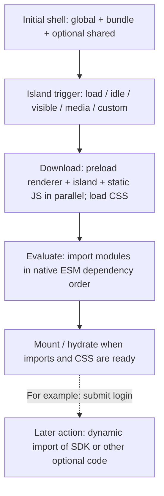

# Runtime script bundling

Use compact mode to keep the initial page small and load React only when an island
activates. It allows **at most three new JS assets for the shell and for each L5E
island activation**, not three files over the page's entire lifetime.

The staged API is available since `1.1.0-alpha.2`; stable `1.0.1` does not include it.
Use `1.1.0-alpha.3` for correct dev runtime selection and the fix that keeps eager
helpers from pulling React into `global`.

## Configure

```ts
import { defineConfig } from 'vite';
import { coreVite } from '@withl5e/l5e/vite-plugin';

export default defineConfig(({ command }) => ({
  plugins: [
    coreVite({
      chunking:
        command === 'build'
          ? {
              mode: 'compact',
              shared: [{ name: 'state', modules: ['~/stores/session.ts'] }],
            }
          : undefined,
    }),
  ],
}));
```

Merge this into your existing Vite config; `~/` uses your application's alias.
Omit `shared` if no state must be shared across page bundles. Compact mode accepts
one shared group and includes its minimum static dependencies automatically.
Development keeps source-module loading and HMR, without the production file limit.

If islands share a React context, hook or query client, add `islandRuntime` alongside
`shared`. React and React DOM already belong to the lazy runtime:

```ts
islandRuntime: {
  packages: ['@nanostores/react', '@tanstack/react-query'],
  modules: ['~/client/use-session.ts', '~/client/query-client.ts'],
},
```

Select only roots needed by your app. Their static dependencies join the runtime;
shared/global ownership takes precedence and dynamic imports keep their own trigger.

## What each file does

| Output          | Contents                                                                 | First needed             |
| --------------- | ------------------------------------------------------------------------ | ------------------------ |
| `global-*.js`   | `src/client.global.ts`, bootstrap and dependencies shared with page code | Initial shell            |
| `bundle-*.js`   | Client scripts selected by the rendered page                             | Initial shell            |
| `shared-*.js`   | Explicit stores, caches or registries and their minimum dependencies     | Shell, when needed       |
| `renderer-*.js` | React, React DOM, Scheduler and configured `islandRuntime` modules       | First island activation  |
| `island-*.js`   | One island's component and private static dependencies                   | That island's activation |

Islands reuse the renderer and shared state within the document. State is not shared
with SSR, other tabs or a full reload. Keep singleton state in imported modules,
because page entry side effects can run again in another page bundle.



Preloading downloads code without running its side effects. L5E embeds the activation
plan in the page, so activation needs no manifest request and schedules all known
static JS before waiting for responses. Lazy entries are not preloaded by initial HTML.

## Choose when to load

```tsx
import { ClientIsland } from '@withl5e/l5e/island';

<ClientIsland from="./react/Comments" props={{ postId }} mount="visible" />;
```

Use `load` for immediately required UI, `visible` for content below the fold, `idle`
for noncritical work, and `media` for a matching media query. `none` never mounts
automatically. For dialogs or other interaction triggers, register a custom strategy
with `registerMountStrategy` from `@withl5e/l5e/island/client` and call its mount
callback on that interaction. The strategy delays download, evaluation and hydration.
A `load` island or an already visible island starts loading just after the shell.

## Optimize and verify

- Keep `client.global.ts` small. Importing React or a heavy UI library there makes it
  part of the initial download regardless of the island's mount strategy.
- Put shared mutable state in `shared`; put canonical UI contexts in `islandRuntime`.
  Ordinary helpers follow their owner. Do not move every library into either group
  just to reduce request counts.
- Keep SDKs, editors and optional tools behind their actual action's `import()`.
  Adding them to `islandRuntime` makes every first island pay that download cost.
- Measure cold-cache **raw/gzip bytes and request timing per stage**. Check the shell
  before triggering islands, then open or scroll to each island and exercise its UI.
  Check fetched bodies as well as filenames: three requests can still carry React
  bytes too early. `.vite/l5e-chunks.json` shows module ownership for diagnosis.
- Test shared-state updates across islands and page swaps. Framework regression tests
  also hold a response to verify static dependencies start downloading in parallel:

```sh
pnpm --filter @withl5e/l5e test
pnpm --filter @withl5e/e2e-tests test:shared-modules
```

Concurrent island activations can together exceed three requests. Application-owned
SDK imports retain Vite's chunk graph and need a separate audit. Compact mode requires
native import maps. Restart the production server after replacing its build.

Without compact mode, L5E preserves emitted dependency URLs and module identity;
execution-order constraints can require additional requests. Use `chunking: false`
when managing chunk placement directly through Rolldown.
